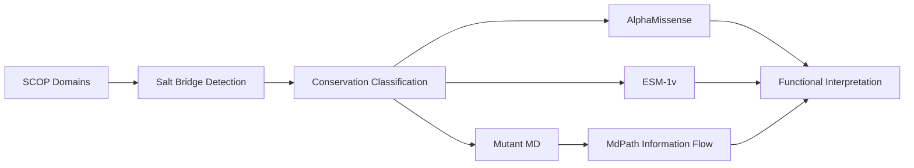

# Multi-scale Salt Bridge Analysis Framework

A reproducible computational framework for identifying, classifying, and functionally characterizing salt bridges across protein families using **structure**, **machine learning**, and **dynamics-based information flow**.

This repository integrates three complementary modules:

- **Structural pipeline** — detect conserved salt bridges across SCOP families  
- **ML prediction pipeline** — evaluate mutational sensitivity using AlphaMissense and ESM-1v  
- **MdPath analysis** — quantify information-flow rewiring upon mutation  

Together, these components enable multi-scale interpretation of salt-bridge conservation from **3D geometry → evolutionary constraint → dynamic coupling**.

---

## Repository Architecture



---

# Modules

## 1. Structural Salt Bridge Pipeline

**Goal:** Identify conserved and non-classical salt bridges across protein families.

Location:

```
saltbridge_pipeline/
```

Core capabilities:

- SCOP domain parsing and structural alignment  
- automated salt-bridge detection  
- spatial clustering of bridge centers  
- classification into classical vs non-classical conserved bridges  

Produces the structural foundation for downstream analyses.

👉 See module README for full workflow.

---

## 2. ML Prediction Pipeline (AlphaMissense + ESM-1v)

**Goal:** Quantify evolutionary constraint at salt-bridge residues.

Location:

```
ml_prediction_pipeline/
```

Key analyses:

- PDB → UniProt residue mapping  
- AlphaMissense pathogenicity extraction  
- ESM-1v zero-shot mutational scoring  
- replicate-consistent residue ranking  

Large external datasets are required but **not distributed** in this repository.

👉 See module README for setup and commands.

---

## 3. MdPath Information-Flow Analysis

**Goal:** Detect mutation-induced rewiring of residue communication networks.

Location:

```
mdpath_pipeline/
```

Workflow:

1. Run MdPath on WT and mutant trajectories  
2. Compute divergence fields (Mut − WT)  
3. Attribute changes to residue-level signals  
4. Average across replicate simulations  

MD trajectories are intentionally excluded due to size.

👉 See module README for environment setup and execution.

---

# Data Policy

This repository tracks:

- source code  
- notebooks  
- lightweight metadata  
- original structure files  

The following are **NOT included**:

- MD trajectories  
- AlphaMissense dataset  
- ESM model weights  
- large result tables  

All analyses are fully reproducible using publicly available resources described in each module.

---

# Environment Overview

Each module has independent requirements.

Typical stack:

- Python ≥ 3.9  
- PyMOL (structural pipeline)  
- PyTorch + fair-esm (ML pipeline)  
- MdPath executable (information-flow analysis)  

Refer to module READMEs for exact installation steps.

---

# Reproducibility

The design philosophy of this project is:

> **code-first, data-reconstructable**

Users should be able to regenerate all reported results by:

1. downloading public datasets  
2. running the pipelines  
3. executing the analysis notebooks  

No proprietary data are required.

---

# Recommended Citation

If this repository contributes to your research, please cite:

- AlphaMissense — Nature (2023)  
- ESM Protein Language Models  
- SCOP Structural Classification  
- MdPath  
- The associated manuscript describing this framework  

---

# License

**MIT License**

This permissive license allows reuse while preserving attribution.

---

# Contact

For questions, collaboration, or data requests, please open an issue in this repository.

