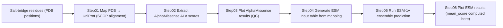

# ML Prediction Pipeline (AlphaMissense + ESM-1v)

This module evaluates mutational sensitivity of salt-bridge residues using:
- **AlphaMissense** (pathogenicity / variant effect scores)
- **ESM-1v** (zero-shot mutational effect; 5-model ensemble)

We map salt-bridge residues from **PDB → UniProt**, retrieve mutation scores, and validate conservation signals.

---

## Pipeline overview (6 steps)



---

## Data availability and sources

This project relies on public datasets/models. Due to size and licensing, they are **not redistributed** in this repository.

### SCOP mapping file
Used for PDB–UniProt residue alignment.

- Source: https://www.ebi.ac.uk/pdbe/scop/files/scop-cla-latest.txt  
- Place at: `data/scop/scop-cla-latest.txt`

### AlphaMissense dataset
Used to retrieve variant scores (we extract **X→A** entries at mapped positions).

- Portal: https://alphamissense.hegelab.org/  
- Required file: `AlphaMissense_aa_substitutions.tsv`  
- Place at: `data/alphamissense/AlphaMissense_aa_substitutions.tsv`

### ESM-1v models
Used for zero-shot mutational effect prediction.

- Official repo: https://github.com/facebookresearch/esm  
- Models: `esm1v_t33_650M_UR90S_1–5`  
- Install: `pip install fair-esm` (models download automatically)

---

## Repository structure

```text
ml_prediction_pipeline/
├── scripts/
│   ├── step01_map_pdb_to_uniprot.py
│   ├── step02_extract_alphamissense.py
│   ├── step04_prepare_esm_input.py
│   └── predict-pzy3.py                  # ESM inference (5-model ensemble)
│
├── notebooks/
│   ├── step03_plot_alphamissense.ipynb  # AM_pic.ipynb (QC figures)
│   └── step06_plot_esm_results.ipynb    # ESM plots + mean_score
│
├── data/                                 # not tracked in git
│   ├── scop/
│   ├── alphamissense/
│   ├── mapping/
│   ├── esm_input/
│   └── uniprot/                          # optional: fasta files
│
└── results/
    ├── alphamissense/
    ├── esm/
    └── figures/
```

---

## Installation

Recommended environment:

```bash
conda create -n saltbridge-ml python=3.10 -y
conda activate saltbridge-ml
pip install torch fair-esm pandas numpy matplotlib tqdm
```

GPU is strongly recommended for ESM.

---

## Step-by-step usage

### Step01 — Map PDB residues to UniProt (SCOP alignment)
Input: salt-bridge list in PDB coordinates + SCOP mapping file  
Output: `mapping_*.csv`

```bash
python scripts/step01_map_pdb_to_uniprot.py \
  --saltbridge-dir data/saltbridges_txt \
  --scop-file data/scop/scop-cla-latest.txt \
  --output data/mapping/mapping_cla.csv
```

---

### Step02 — Extract AlphaMissense scores (X→A)
Input: `mapping_*.csv` + `AlphaMissense_aa_substitutions.tsv`  
Output: `*_AM_scores.csv`

```bash
python scripts/step02_extract_alphamissense.py \
  --mapping data/mapping/mapping_cla.csv \
  --am-tsv data/alphamissense/AlphaMissense_aa_substitutions.tsv \
  --output results/alphamissense/cla_AM_scores.csv
```

---

### Step03 — Plot AlphaMissense results (QC)
Notebook:

- `notebooks/step03_plot_alphamissense.ipynb`

---

### Step04 — Generate ESM input CSV
Input: `mapping_*.csv` (+ UniProt FASTA if required by your workflow)  
Output: `data/esm_input/*.csv`

```bash
python scripts/step04_prepare_esm_input.py \
  --mapping data/mapping/mapping_cla.csv \
  --fasta data/uniprot/uniprot.fasta \
  --output data/esm_input/cla_ESM_input.csv
```

---

### Step05 — Run ESM-1v ensemble (5 models)
Input: ESM input CSV  
Output: ESM result CSV with 5 model columns

```bash
python scripts/predict-pzy3.py \
  --model-location esm1v_t33_650M_UR90S_1 esm1v_t33_650M_UR90S_2 esm1v_t33_650M_UR90S_3 esm1v_t33_650M_UR90S_4 esm1v_t33_650M_UR90S_5 \
  --dms-input data/esm_input/cla_ESM_input.csv \
  --dms-output results/esm/resultESM-cla.csv
```

---

### Step06 — Plot ESM results (mean_score computed here)
Notebook:

- `notebooks/step06_plot_esm_results.ipynb`

This notebook computes:

- `mean_score = mean(esm1v_t33_650M_UR90S_1..5)` (if not already present)

and saves figures into:

- `results/figures/`

---

## Notes

- We use alanine substitutions (X→A) for consistent perturbation across residue types.
- `data/` and `results/` can be large; consider ignoring them in `.gitignore`.

---

## Citation

Please cite:
- AlphaMissense
- ESM-1v
- SCOP
- The associated manuscript
