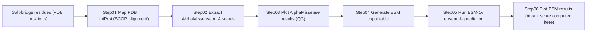

# ML Prediction Pipeline (AlphaMissense + ESM-1v)

This module evaluates mutational sensitivity of spatially conserved salt-bridge residues using:

- **AlphaMissense** — genome-scale pathogenicity prediction  
- **ESM-1v** — protein language model for zero-shot mutational effect estimation  

Salt-bridge residues are mapped from **PDB → UniProt**, mutation scores are retrieved, and evolutionary constraints are analyzed.

---

## Pipeline Overview (6 Steps)



---

# Data Availability

This project relies exclusively on **public datasets and models**.  
Due to file-size limits and licensing constraints, large datasets are **NOT redistributed** in this repository.

The repository intentionally contains only:

- code  
- lightweight metadata  
- notebooks  

to ensure fast cloning and long-term maintainability.

---

## SCOP Structural Classification

Used for mapping PDB residues to UniProt coordinates.

Download:

https://www.ebi.ac.uk/pdbe/scop/files/scop-cla-latest.txt

Place under:

```
data/scop/scop-cla-latest.txt
```

---

## AlphaMissense Variant Dataset

Publication:

> Cheng et al., Nature (2023) — AlphaMissense

Download:

https://alphamissense.hegelab.org/

Required file:

```
AlphaMissense_aa_substitutions.tsv
```

Place under:

```
data/alphamissense/
```

⚠️ File size is large (tens of GB).  
High-speed storage is recommended.

---

## ESM‑1v Protein Language Model

Official repository:

https://github.com/facebookresearch/esm

Install:

```bash
pip install fair-esm
```

Models used:

```
esm1v_t33_650M_UR90S_1–5
```

Models download automatically on first use.

⚠️ GPU is strongly recommended.

---

# Large Files Policy

Some intermediate and result files (e.g., ESM prediction tables) exceed GitHub’s file-size limits and are therefore **not tracked in this repository**.

Examples include:

- ESM prediction CSV tables  
- Extracted AlphaMissense score tables  
- Merged datasets  

All results can be fully reproduced by running the pipeline.

Large tables can be provided upon reasonable request or hosted on external data platforms such as Zenodo or Figshare.

---

# Repository Structure

```
ml_prediction_pipeline/
│
├── scripts/
│   ├── step01_map_pdb_to_uniprot.py
│   ├── step02_extract_alphamissense.py
│   ├── step04_prepare_esm_input.py
│   └── predict-pzy3.py
│
├── notebooks/
│   ├── step03_plot_alphamissense.ipynb
│   └── step06_plot_esm_results.ipynb
│
├── data/        # NOT tracked in git
└── results/     # NOT tracked in git
```

---

# Installation

Recommended environment:

```bash
conda create -n saltbridge-ml python=3.10 -y
conda activate saltbridge-ml

pip install torch fair-esm pandas numpy matplotlib tqdm
```

GPU recommended for ESM inference.

---

# Step-by-Step Usage

## Step01 — Map PDB residues to UniProt

```bash
python scripts/step01_map_pdb_to_uniprot.py   --saltbridge-dir data/saltbridges_txt   --scop-file data/scop/scop-cla-latest.txt   --output data/mapping/mapping_cla.csv
```

---

## Step02 — Extract AlphaMissense scores

```bash
python scripts/step02_extract_alphamissense.py   --mapping data/mapping/mapping_cla.csv   --am-tsv data/alphamissense/AlphaMissense_aa_substitutions.tsv   --output results/alphamissense/cla_AM_scores.csv
```

---

## Step03 — Plot AlphaMissense Results

Notebook:

```
notebooks/step03_plot_alphamissense.ipynb
```

Used for QC and statistical visualization.

---

## Step04 — Generate ESM Input

```bash
python scripts/step04_prepare_esm_input.py   --mapping data/mapping/mapping_cla.csv   --fasta data/uniprot/uniprot.fasta   --output data/esm_input/cla_ESM_input.csv
```

---

## Step05 — Run ESM‑1v Ensemble

```bash
python scripts/predict-pzy3.py   --model-location esm1v_t33_650M_UR90S_1 esm1v_t33_650M_UR90S_2                    esm1v_t33_650M_UR90S_3 esm1v_t33_650M_UR90S_4                    esm1v_t33_650M_UR90S_5   --dms-input data/esm_input/cla_ESM_input.csv   --dms-output results/esm/resultESM-cla.csv
```

---

## Step06 — Plot ESM Results (Mean Score Computed Here)

Notebook:

```
notebooks/step06_plot_esm_results.ipynb
```

This notebook automatically computes:

```
mean_score = mean(esm1v_t33_650M_UR90S_1..5)
```

and generates figures under:

```
results/figures/
```

---

# Reproducibility Statement

All analyses in this repository can be reproduced using:

1. Public SCOP classification  
2. AlphaMissense dataset  
3. Official ESM models  

No proprietary datasets are required.

---

# Compute Requirements

Recommended:

- GPU with ≥16GB VRAM for ESM  
- ≥32–64GB RAM for large AlphaMissense tables  
- SSD / high-speed network storage  

---

# Citation

If you use this pipeline, please cite:

- AlphaMissense (Nature 2023)  
- ESM-1v  
- SCOP  
- The associated manuscript  

---

# License

Recommended: MIT License

This permissive license maximizes reuse while maintaining attribution.
