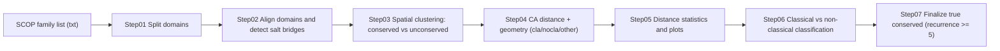

# SCOP Salt Bridge Identification & Classification

A reproducible pipeline to **split SCOP domains**, **align domains within a family**, **detect salt bridges**, and classify them into **conserved / unconserved**, and further into **classical conserved / non-classical conserved** salt bridges.

---

## Pipeline overview



---

## Key thresholds (as used in this project)

- **Salt bridge detection (Step02):** Asp/Glu ↔ Lys/Arg within **5.0 Å**
- **Spatial conservation (Step03):** salt-bridge center distance ≤ **2.0 Å**
- **True conservation (Step07):** same-position salt bridge observed **≥ 5 times**
- **Cα-based residue proximity (classical vs non-classical):**
  - **Classical conserved:** Cα–Cα distance ≤ **2.0 Å**
  - **Non-classical conserved:** Cα–Cα distance ≤ **3.0 Å**

---

## Repository structure (recommended)

```text
scripts/
  step01_split_scop_domains.py
  step02_align_domains_detect_saltbridges.py
  step04_extract_ca_coordinates.py
  step07_finalize_true_conserved.py
  utils/                           # put com.py/com2.py here

notebooks/
  step03_cluster_conserved_vs_unconserved.ipynb
  step05_distance_statistics_visualization.ipynb
  step06_classify_classical_vs_nonclassical.ipynb

```

---

## Installation

This project relies on **PyMOL Python API**.

Recommended environment:

```bash
conda create -n saltbridge python=3.10 -y
conda activate saltbridge
conda install -c conda-forge pymol-open-source numpy pandas matplotlib jupyterlab -y
```

---

## Input formats

### Family domain list  
`data/family_lists/<family_id>.txt`

Supported formats:

**3 columns**
```
PDBID CHAIN RES_RANGE
1abc A 10-120
```

**4 columns (discontinuous segments)**
```
PDBID CHAIN RES_RANGE1 RES_RANGE2
1abc A 10-50 80-120
```

**5 columns (two-chain domain)**
```
PDBID CHAIN1 RES_RANGE1 CHAIN2 RES_RANGE2
1abc A 10-50 B 1-60
```

---

## Step-by-step usage

### Step01 — Split SCOP domains

```bash
python scripts/step01_split_scop_domains.py \
  --input data/raw_families \
  --list-dir data/family_lists \
  --output data/domains
```

Output:

```
data/domains/<family_id>/*.cif
```

---

### Step02 — Align domains & detect salt bridges

> Requires `com.py` / `com2.py` placed in `scripts/utils/`

```bash
python scripts/step02_align_domains_detect_saltbridges.py \
  --list-dir data/family_lists \
  --domain-dir data/domains \
  --output results/step02_saltbridges_raw \
  --utils-dir scripts/utils
```

---

### Step03 — Spatial clustering (conserved vs unconserved)

Notebook:

```
notebooks/step03_cluster_conserved_vs_unconserved.ipynb
```

Definition:

```
bridge center distance ≤ 2 Å → conserved
```

---

### Step04 — Extract Cα distances & geometry

```bash
python scripts/step04_extract_ca_coordinates.py \
  -f <family_id> \
  -i results/step03_clusters \
  -o results/step04_ca_distances \
  -r data/family_lists/reference.txt \
  -p data/domains
```

Optional PyMOL sessions:

```bash
--pse --pse-dir results/step04_ca_distances/pse
```

---

### Step05 — Distance statistics & visualization

Notebook:

```
notebooks/step05_distance_statistics_visualization.ipynb
```

---

### Step06 — Classical vs non-classical classification

Notebook:

```
notebooks/step06_classify_classical_vs_nonclassical.ipynb
```

Output:

```
results/final_tables/
```

---

### Step07 — Finalize true conserved salt bridges (recurrence ≥ 5)

```bash
python scripts/step07_finalize_true_conserved.py results/final_tables \
  --outdir results/step07_true_conserved_k5 \
  --min_occurrence 5 \
  --key-mode residue
```

---

## Citation

If you use this pipeline in academic work, please cite the corresponding manuscript and/or this repository.

---

## License

Add a LICENSE file (MIT is commonly used for academic code).
